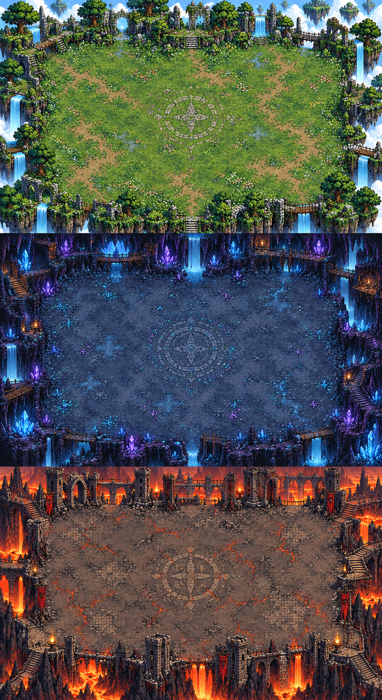

# Bozkır • Son Alp

Godot 4 ile hazırlanmış, Türk mitolojisinden ve karanlık fantezi öğelerinden esinlenen özgün 2D hayatta kalma oyunudur. Dışarıdan asset gerektirmeden, geçici ad ve kodla çizilen görseller kullanılarak geliştirilmiştir.

---

## 🗺️ Bölümler ve Haritalar

Oyun içerisinde birbirinden farklı atmosferlere sahip üç ana kat (harita) tasarımı bulunmaktadır. Alanı dört katına (3600×2240) çıkartılan haritalarda 180 saniyelik bir gece-gündüz çevrimi yaşanır.

* **1. Kat (Doğa):** Yeşil bitki örtüsüne, şelalelere ve uçan adalara sahip başlangıç seviyesi.
* **2. Kat (Mağara):** Karanlık atmosferiyle dikkat çeken, mavi parlayan devasa kristallerin ve yeraltı sularının bulunduğu orta seviye.
* **3. Kat (Volkanik/Madness):** Lav nehirlerinin aktığı, kızıl alevlerin ve yıkılmış kale surlarının yer aldığı en zorlu seviye.

---

## ⚔️ Karakterler ve Yol Arkadaşları

Karakter seçim ekranında savaşçıların bekleme, koşu, saldırı ve ölüm animasyonları sırayla gösterilmektedir. Oyunda seçilebilecek karakterler ve onlara eşlik eden yol arkadaşları (pet/bot) şunlardır:

* **Alp:** Başlangıçtan itibaren açıktır (100 Can, 145 Hız). Geniş kılıç savuruşu yapar. Seviye 21 ve sonrasında Hobbit yol arkadaşı ile birlikte savaşır.
* **Kam:** 1. bölüm zaferinde açılır. Çevresine ruh dalgası yayar. Seviye 30 ve sonrasında Bot yol arkadaşı eşlik eder.
* **Okçu & Kargıcı & Demirci:** İlerleyen bölümlerde sırasıyla açılırlar. Gerçek ok mermileri, mızrak veya ağır çekiç saldırıları uygularlar.
* **Kıyat:** Herhangi bir evcil hayvanı (pet) bulunmamaktadır.
* **Yelme & Çura:** Geçici olarak Hobbit yol arkadaşına sahiptirler.

---

## 💀 Karanlığın Ordusu (Düşmanlar ve Bosslar)

Oyundaki zorluk ilerleyişi "Kat gücü: %50 -> %75 -> Madness" şeklinde artmaktadır. Düşmanlar belirli dalgalara (wave) ve dakikalara göre arenaya dahil olur.

### Normal ve Sürü Düşmanları
* **Zombi:** 1. dalgadan itibaren arenada belirir. Düşük can/hasara sahiptir ancak her dalgada güçlenir.
* **Karanlık Yaratık:** 3. dalgadan itibaren ortaya çıkar. (Çürük ağaçlar da bu evrede alan saldırıları ile katılır).
* **Kurtlar:** 5. dalgada Beyaz Kurt (Orta zorluk), 7. dalgada Kızıl Kurt (%70) ve 9. dalgada sürü halinde Alfa kurtlar saldırır.
* **Demon:** 4. dakikadan itibaren akın halinde gelmeye başlar.

### Boss Savaşları ve Portal Mekaniği
* **Tepegöz / Yelbeğen:** 1. ve 2. katın ana boss'larıdır.
* **Evil Wizard & Karanlık Ruh:** 3. katın (Madness) mini boss'u ve yerden çıkan özel düşmanlarıdır.
* **Son Büyücü:** 3. katın (Madness) ana boss'udur.
* **Ana Portal:** 10. dalgaya ulaşıldığında haritadaki sunağın bulunması ve boss'un çağrılması zorunludur. Boss öldürüldüğünde uzakta bir portal açılır. Portala girmeden kat değişmez.
* **Kan Ruhu:** Portal açılmadan hemen önce portal öncesi son tehdit olarak ortaya çıkar.

---

## 🎮 Oyun Akışı 

* **Dalgalar:** Her dalga 28 saniye sürer. 10. dalgada boss çağrılır.
* **Geliştirmeler:** Düşen ruh kristalleri toplanarak deneyim kazanılır. Seviye atlandığında oyun duraklar ve üç rastgele geliştirmeden biri seçilir.
* **Harita Etkileşimleri:** Haritada 15 can ve geliştirme veren 9 adet sandık ile yaklaşınca 35 can veren (45 saniyede dolan) 5 adet şifa pınarı bulunur.

---

## ⌨️ Kontroller

* **Hareket:** WASD veya Yön tuşları
* **Atılma (Dash):** Boşluk (Hareket yönüne atılır, arkasında iz bırakır ve hasar verir. 3 saniye bekleme süresi vardır.)
* **Saldırı:** Otomatik (Seçilen karaktere göre değişir)
* **Duraklatma:** Esc / P veya DURAKLAT butonu
* **Mobil:** Sol joystick ile hareket, sağ "ATIL" butonu ile yetenek (Çoklu dokunma desteklenir).

---

## 🛠️ Kurulum ve Çalıştırma

Oyun dosyaları indirildikten sonra, proje klasöründeki **OYNA.cmd** dosyasına çift tıklayarak Godot motoru üzerinden oyunu başlatabilirsiniz.

Projeyi Godot Editör üzerinden açmak için:
1. Godot 4 (4.7.2 sürümü önerilir) Project Manager'ı açın.
2. **Import / İçe Aktar** seçeneği ile `project.godot` dosyasını seçin.
3. Editörde **F5** tuşuna basarak oyunu test edin.

---

## 👤 Geliştirici

**Kadir** – [GitHub: CoiF-ai](https://github.com/CoiF-ai/)
